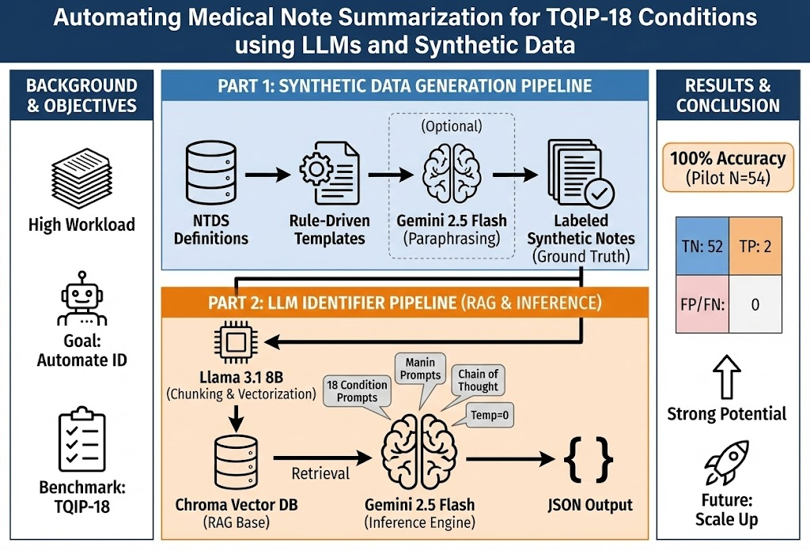

# NTDS-Complication-Extractor
This repository creates a baseline RAG pipeline to test the ability of an LLM to summarize medical notes in the [NTDS-18](https://www.facs.org/quality-programs/trauma/quality/national-trauma-data-bank/national-trauma-data-standard/) Benchmark. The NTDS-18 benchmark is used by TQIP to evaluate hospital performance. The notes generated in data/syntheic_ntds_trauma_notes_gemini.csv are synthetic notes produced by generator (part 1 of our pipeline). These were generated with the help of an LLM. data/ntds_18_complications.json provides an overview of all the complications tested for within the NTDS-18 dataset.

## Data
Because real clinical data, especially trauma notes, are protected and sensitive, all of our test data were synthetically generated. The synthetic data were created based on the [National Trauma Data Standard Data Dictionary 2025 Admission](https://health.wyo.gov/wp-content/uploads/2025/01/2025-Data-Dictionary.pdf) as a structured reference.


## File Structure
<pre>
  <code>
    📁 Project Root
      ├── README.md
      ├── config.json
      ├── data
      │   ├── describe.txt
      │   ├── ntds_18_complications.json
      │   └── synthetic_ntds_trauma_notes_gemini.csv
      ├── environment.yml
      ├── notebooks
      │   └── extraction.ipynb
      └── src
          ├── evaluation.py
          ├── extraction.py
          ├── generate_synthetic_ntds_notes.py
          └── vectorstore.py
    </code>
</pre>

## Introduction
An effective surgical quality program relies on accurate trauma registries, but maintaining these registries is labor-intensive for Level I centers. The ACS Committee on Trauma requires high-quality data on hospital events such as pressure ulcers, unplanned intubations, and delirium, yet these findings are often buried in long, heterogeneous notes and demand clinical judgment to distinguish true complications from expected findings. Large Language Models (LLMs) offer a way to automate this chart review and standardize [Trauma Quality Improvement Program (TQIP)](https://www.facs.org/quality-programs/trauma/quality/trauma-quality-improvement-program/) reporting. Because we could not reuse prior code or real data in Q1, we rebuilt a complete pipeline: a generator of synthetic trauma notes with ground-truth labels for the 18 NTDS complications, and an LLM-based extractor. On an initial set of 54 synthetic notes, our system achieved 100% accuracy (52 true negatives, 2 true positives), illustrating the promise of LLMs for trauma registry support. The below overview was generated by Nano Banana Pro and intended to give an idea of the pipeline.

<p align="center">
  <table>
    <tr>
      <td align="center"></td>
    </tr>
  </table>
</p>

## Quickstart
1. Environment set up
To set up the conda environment for Mac (identifier), type
```
conda env create -f environment.yml
```

alternative, for Windows (generator), consider to use
```
conda env create -f environment_windows.yml
```

Then, activate it:
```
conda activate env
```


## Part 1: Synthetic Medical Note Generator

1. Install Gemini client if you want LLM-based polishing:
```
pip install google-genai
```
Note: this step is optional.
2. Generate synthetic notes without Gemini (template-based only)
```
python src/generate_synthetic_ntds_notes.py \
  --comp_json data/ntds_18_complications.json \
  --n_samples 50 \
  --out_csv data/synthetic_ntds_trauma_notes.csv
```
This is an example of generating 50 notes. You are free to change it.
3. Generate synthetic notes with Gemini polishing
This version first builds notes with templates, then sends each note to Gemini to paraphrase while preserving the 18 complication labels.
```
python src/generate_synthetic_ntds_notes.py \
  --comp_json data/ntds_18_complications.json \
  --n_samples 50 \
  --out_csv data/synthetic_ntds_trauma_notes.csv \
  --use_gemini \
  --gemini_api_key ABCDEFG \
  --gemini_model gemini-2.5-flash
```
This is an example of generating 50 notes. It uses `gemini-2.5-flash` with token key = 'ABCDEFG'. You should replace the key by yours. You are free to change it.

4. Inspect the generated data
The output CSV will appear in data/. Each row is one encounter, note_text is the model input, and the 18 complication columns (aki … vap) are the ground-truth labels. Read `describe.txt`.


## Part 2: LLM Identifier

1. Install `llama3-1:8b`. First, download ollama if you have not done that yet. Then, run:
```
ollama pull llama3.1:8b
```
NOTE: You may use a different embedding model if you don't want to download this. Specify the information in the config file
2. Set up gemini API key to use a model. You can use the free API from [here](https://ai.google.dev/gemini-api/docs/api-key) to generate this API key. After generating the key, create a .env in the root and store the API key in there. Note that there is a rate limit of 10 LLM calls per minute in the free tier which may slow down if many conditions are tested for at once.

3. Configure JSON file (config.json) as intended
Important parameters:
- Complication id: Integer from 0 to 49 should be specified for the complication to be used (from data/synthetic_ntds_trauma_notes_gemini.csv)
- Complication range: Which all specific complications from NTDS-18 to use. [0, 18] will include all complications.

4. Run python file
```
python src/extraction.py
```
You can also specify a custom config file path:
```
python src/extraction.py --config path/to/your/config.json
```
On the first run, it will take some about a minute to create the ChromaDB database.
Brief results will be shown in the console output. Detailed results will be stored in results/

## Experiment Method
The pipeline consisted of 2 parts: a synthetic medical notes generator and a LLM identifier.

First, we sampled demographics and complications from NTDS definitions, generated section-based trauma notes with rule-driven templates, then optionally sent each note to Gemini 2.5 Flash model for paraphrasing so language became more realistic while preserving which complications were truly presented as ground-truth labels exactly.

Then, we created 50 synthetic medical notes using the Gemini 2.5 Flash model with true labels on the TQIP test. These are stored as a CSV in our GitHub repo. We used the Llama 3.1 8B LLM to perform chunking and vectorization into a Chroma vector database for our Retrieval Augmented Generation (RAG). After retrieving the chunks, we used the Gemini 2.5 Flash model to generate outputs as a JSON, which were used. Each of the 18 conditions had an individual prompt for it, so we used the Gemini Flash model to quickly generate results. Chain of Thought and Prompt Engineering was used to improve performance. The temperature was set to be zero.

## Result
For the first synthetic medical note, all 18 conditions were correctly identified to be false. For the second medical note, myocardial infarction and pressure ulcer were correctly identified to be true and the 16 other conditions were correctly identified to be false. For patient 3, all 18 conditions were correctly identified to be false. Note that these performances may be a result of the synthetic medical notes being easier for an LLM to work with than a real medical note, which may be larger in size and contain more extraneous information.


## Contribution
- Kaijie Zhang: Designed the overall generator pipeline, implemented the synthetic medical note generator, integrated Gemini-based paraphrasing, and organized the data schema and codebase for downstream use.

- Viv Somani: Implemented the LLM-based identifier, including the RAG pipeline, prompt and JSON schema design for the 18 NTDS complications, and ran experiments and evaluation on the synthetic dataset.